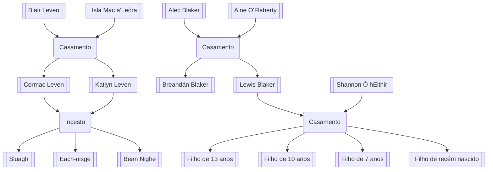

```mermaid
graph TD
	BLAIR[[Blair Leven]] --> r001(Casamento)
	
	ISLA[[Isla Mac a'Leòra]] --> r001

	r001 --> CORMAC[[Cormac Leven]]
	r001 --> KATLYN[[Katlyn Leven]]

	CORMAC --> r002(Incesto)
	KATLYN --> r002

	r002 --> SLUAGH[[Sluagh]]
	r002 --> EACHUISGE[[Each-uisge]]
	r002 --> BEANNIGHE[[Bean Nighe]]

class BLAIR,ISLA,CORMAC,KATLYN,SLUAGH,EACHUISGE,BEANNIGHE internal-link;
	
	ALEC[[Alec Blaker]] --> r003(Casamento)
	AINE[[Aine O'Flaherty]] --> r003


	r003 --> BREANDAN[[Breandán Blaker]]
	
	r003 --> LEWIS[[Lewis Blaker]]

	LEWIS --> r004(Casamento)
	SHANNON[[Shannon Ó hEithir]] --> r004

	r004 --> F1[[Filho de 13 anos]]
	r004 --> F2[[Filho de 10 anos]]
	r004 --> F3[[Filho de 7 anos]]
	r004 --> F4[[Filho de recém nascido]]

class ALEC,AINE,BREANDAN,LEWIS,SHANNON,F1,F2,F3,F4 internal-link;


```
